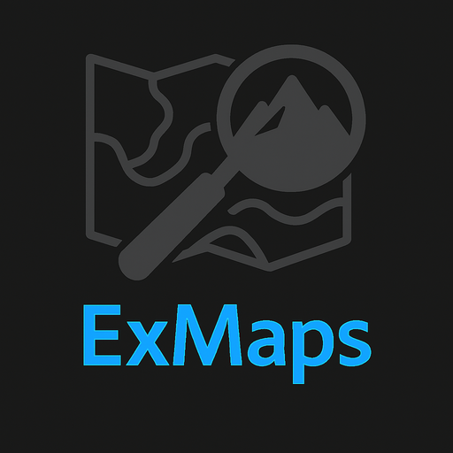

  

# ExMaps

**ExMaps** es una herramienta web desarrollada por [**troNpo**](https://github.com/troNpo) como complemento directo para la app [**OruxMaps GP**](https://play.google.com/store/apps/details?id=com.orux.oruxmapsDonate). Su propósito es facilitar la búsqueda, exploración y exportación de **POIs (Puntos de Interés)** desde mapas interactivos basados en **OpenStreetMap**, usando consultas optimizadas con [**Overpass Turbo**](https://overpass-turbo.eu/).

> ⚠️ ExMaps no reemplaza OruxMaps GP; ofrece una alternativa a la búsqueda de pois de la app, localizar lugares clave y exportarlos en formato compatible para usarlos directamente en OruxMaps Gp.

---

## 🔎 ¿Qué puedes hacer con ExMaps?

- Buscar POIs por categoría en cualquier zona del mapa.
- Visualizar detalles enriquecidos de cada POI.
- Exportar resultados en formato `.kml` compatible con OruxMaps GP.
- Compartir ubicaciones o abrirlas en servicios externos como StreetView o Mapillary.
- Usar la app desde el navegador o instalarla como una **PWA** (App Web Progresiva).

---

## 🧰 Tecnologías utilizadas

- HTML, CSS y JavaScript
- Leaflet + OpenStreetMap
- Overpass API + Nominatim
- GitHub Pages
- Manifest & Service Worker para soporte PWA

---

## 🧑‍💻 Autor

Desarrollado por [**troNpo**](https://github.com/troNpo)

---

## 🤖 Colaborador

Con ayuda de [**Copilot**](https://play.google.com/store/apps/details?id=com.microsoft.copilot), el asistente inteligente de Microsoft que potencia ideas, mejora código y apoya el desarrollo de proyectos web modernos.

---

## 📜 Atribuciones

- Datos geográficos por [**OpenStreetMap contributors**](https://www.openstreetmap.org/copyright)
- Servicios de consulta por [**Overpass API (FOSSGIS e.V.)**](https://www.fossgis.de/)
- Geocodificación por [**Nominatim**](https://nominatim.org/)
- Visualización cartográfica mediante [**Leaflet**](https://leafletjs.com/)
- Imágenes callejeras mediante [**Google Street View**](https://www.google.com/streetview/) y [**Mapillary**](https://www.mapillary.com/)
- Iconos descargados desde [Flaticon](https://www.flaticon.com/), propiedad de Freepik Company S.L.
- Iconos del Repositorio oficial Mapsforge para los POIs,algunos modificados en forma y color.
  
- OruxMaps es una aplicación independiente, propiedad de José Vázquez.

---

> 🧪 Proyecto en desarrollo — versión de prueba.  
> Se recomienda usar en dispositivos móviles o tabletas para una experiencia óptima.
